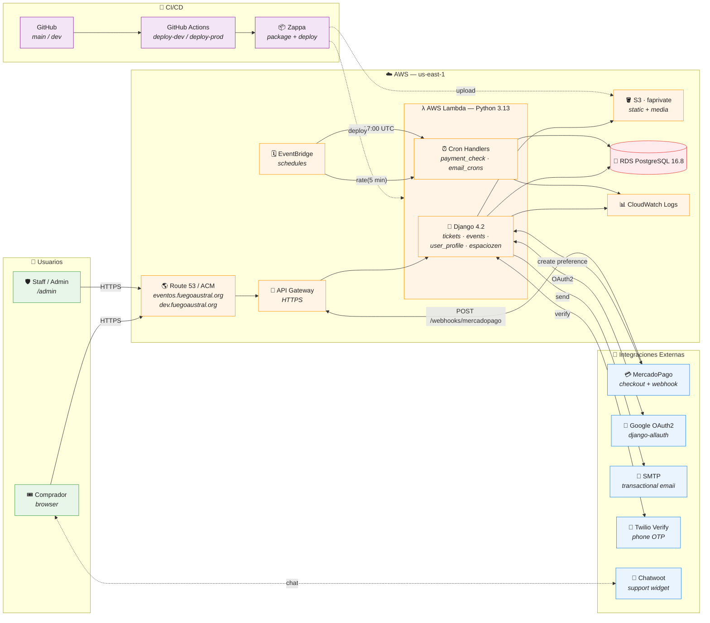
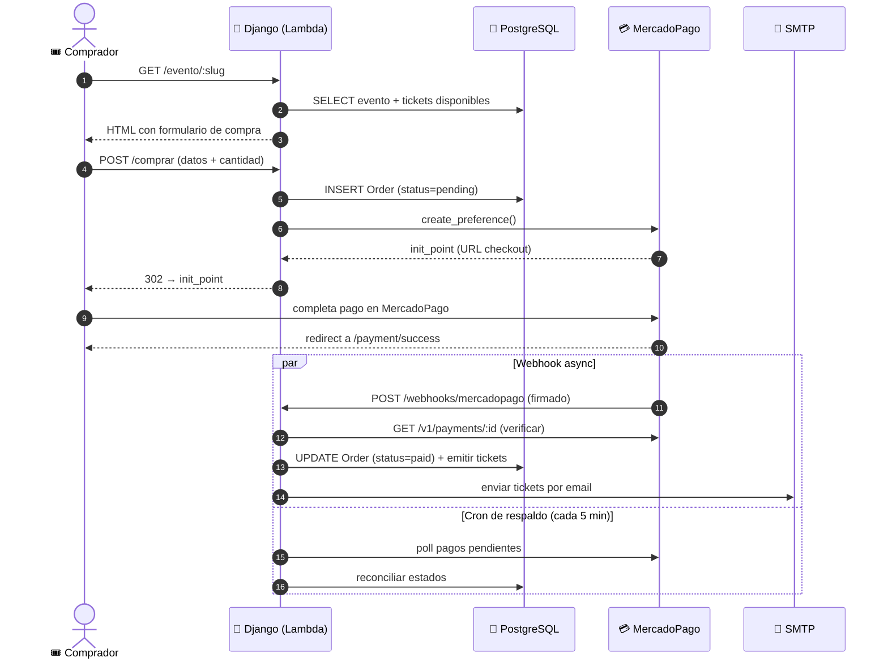

# 🎫 Ticketera de FA

> **Sistema de venta de tickets para eventos de Fuego Austral** 🔥

**Documentación de dominio y reglas de negocio** (casos de uso, modelos, integraciones): ver la carpeta [`docs/`](docs/README.md).

[](https://python.org)
[](https://djangoproject.com)
[](https://aws.amazon.com/lambda/)
[](https://github.com/Miserlou/Zappa)

## 📋 Índice

- [📚 Documentación de producto (`/docs`)](docs/README.md)
- [🚀 Características](#-características)
- [🛠️ Desarrollo Local](#️-desarrollo-local)
  - [📋 Requisitos Previos](#-requisitos-previos)
  - [⚙️ Configuración del Entorno](#️-configuración-del-entorno)
  - [🔄 Migración de Base de Datos](#-migración-de-base-de-datos)
  - [🔗 Integraciones Externas](#-integraciones-externas)
- [🛠️ Herramientas de Desarrollo](#️-herramientas-de-desarrollo)
- [🚀 Deploy](#-deploy)
- [🎪 Agregar un Nuevo Evento](#-agregar-un-nuevo-evento)
- [🏗️ Arquitectura](#️-arquitectura)
- [🛠️ Tecnologías](#️-tecnologías)
- [🔧 Troubleshooting](#-troubleshooting)
- [📞 Soporte](#-soporte)

## 🚀 Características

- 🎟️ **Gestión de eventos** - Crear y administrar eventos de manera sencilla
- 💳 **Pagos integrados** - Integración con MercadoPago para procesamiento de pagos
- 🔐 **Autenticación** - Login con Google OAuth2
- 📧 **Notificaciones** - Sistema de emails automáticos
- ☁️ **Deploy automático** - CI/CD con GitHub Actions
- 🐍 **Python 3.13** - Última versión de Python con mejoras de rendimiento

## 🛠️ Desarrollo Local

### 📋 Requisitos Previos

- **PostgreSQL** (v16.8 en producción, v15.6+ en desarrollo. En cualquier momento migramos todo a 17) 🐘
- **Python 3.13** (última versión) 🐍
- **Git** para clonar el repositorio 📦

### ⚙️ Configuración del Entorno

#### 🔧 Variables de Entorno

Crea un archivo `.env` basado en el template:

```bash
cp env.example .env
```

> 📝 **Configura las variables de base de datos** en tu archivo `.env`:
> - `DB_HOST` - Host de tu base de datos PostgreSQL
> - `DB_USER` - Usuario de la base de datos  
> - `DB_DATABASE` - Nombre de la base de datos
> - `DB_PASSWORD` - Contraseña de la base de datos

#### 🐍 Configuración de Python

1. **Crear entorno virtual** 🌐

```bash
python3.13 -m venv venv
source venv/bin/activate
```

> 💡 **Tip**: Para salir del entorno virtual ejecuta `deactivate`

2. **Instalar dependencias** 📦

```bash
(venv)$ pip install -r requirements.txt
(venv)$ pip install -r requirements-dev.txt
```

3. **Configurar settings locales** ⚙️

```bash
(venv)$ cp deprepagos/local_settings.py.example deprepagos/local_settings.py
```

#### 🗄️ Base de Datos Local

1. **Iniciar PostgreSQL** 🚀

```bash
# macOS
brew services start postgresql@17

# Ubuntu/Debian
sudo systemctl start postgresql
```

2. **Crear base de datos** 🏗️

```bash
(venv)$ createdb deprepagos_development
```

3. **Aplicar migraciones** 🔄

```bash
(venv)$ python manage.py migrate
```

4. **Crear usuario administrador** 👤

```bash
(venv)$ python manage.py createsuperuser
```

### 🔄 **Migración de Base de Datos**

Si necesitas migrar datos desde PostgreSQL 15 (producción) a PostgreSQL 17 (local), usa nuestro script automatizado:

#### 📋 **Proceso de Migración**

1. **Configurar variables de entorno** en tu archivo `.env`:
   ```bash
   DB_HOST=tu_host_de_produccion
   DB_USER=tu_usuario
   DB_DATABASE=tu_database
   DB_PASSWORD=tu_password
   ```

2. **Ejecutar migración completa**:
   ```bash
   ./migrate_db.sh all
   ```

3. **O ejecutar paso a paso**:
   ```bash
   ./migrate_db.sh dump      # Hacer dump desde producción
   ./migrate_db.sh create    # Crear nuevo schema
   ./migrate_db.sh restore   # Restaurar datos
   ```

#### 🎯 **Opciones del Script**

- `dump` - Hacer dump desde PostgreSQL 15 (producción)
- `create` - Crear nuevo schema en PostgreSQL 17 (local)
- `restore` - Restaurar dump en el nuevo schema
- `all` - Ejecutar todo el proceso completo
- `help` - Mostrar ayuda

#### ⚙️ **Configurar Django para Nuevo Schema**

Después de la migración, actualiza tu `local_settings.py`:

```python
DATABASES = {
    'default': {
        'ENGINE': 'django.db.backends.postgresql',
        'NAME': 'postgres',
        'USER': 'tu_usuario',
        'PASSWORD': 'tu_password',
        'HOST': 'localhost',
        'PORT': '5432',
        'OPTIONS': {
            'options': '-c search_path=ticketera_new,public'
        }
    }
}
```

> 💡 **Tip**: El script crea un schema llamado `ticketera_new` para mantener los datos separados del schema `public`

### 🔗 Integraciones Externas

#### 💳 MercadoPago

1. **Crear usuario de prueba** en [MercadoPago](https://www.mercadopago.com.ar/developers/es/docs/your-integrations/test/accounts) 🧪
2. **Configurar variables**:
   - `MERCADOPAGO_PUBLIC_KEY`
   - `MERCADOPAGO_ACCESS_TOKEN`
   - `MERCADOPAGO_WEBHOOK_SECRET`

3. **Configurar webhook** apuntando a `{tu_url_local}/webhooks/mercadopago` 🔗

> 🌐 **Para exponer tu servidor local**: Usa [Cloudflare Tunnel](https://developers.cloudflare.com/cloudflare-one/connections/connect-networks/get-started/create-remote-tunnel/) o [ngrok](https://ngrok.com/)

#### 🔐 Google OAuth2

1. **Crear proyecto** en [Google Cloud Platform](https://console.cloud.google.com/) ☁️
2. **Habilitar Google+ API** 📡
3. **Crear credenciales OAuth 2.0** 🔑
4. **Configurar variables**:
   - `GOOGLE_CLIENT_ID`
   - `GOOGLE_CLIENT_SECRET`
5. **Agregar URI de redirección**: `{tu_url_local}/accounts/google/login/callback/` 🔄

#### 📧 Testing de Emails

Usa [Mailtrap](https://mailtrap.io/) para testing de emails 📬

1. Crear cuenta en Mailtrap
2. Obtener credenciales SMTP de **Email Testing > Inboxes > SMTP**
3. Configurar en tu `.env`

### 🏃‍♂️ Ejecutar el Servidor

```bash
(venv)$ python manage.py runserver
```

¡Listo! 🎉 Tu aplicación estará disponible en `http://127.0.0.1:8000`

## 🛠️ Herramientas de Desarrollo

### 🗄️ **Script de Migración de Base de Datos**

El proyecto incluye un script automatizado para migrar datos entre diferentes versiones de PostgreSQL:

#### 📁 **Archivos Incluidos**
- `migrate_db.sh` - Script principal de migración
- `env.example` - Template de variables de entorno

#### 🚀 **Uso Rápido**
```bash
# Configurar variables de entorno
cp env.example .env
# Editar .env con tus datos

# Ejecutar migración completa
./migrate_db.sh all
```

#### 🔧 **Características del Script**
- ✅ **Carga automática** de variables desde `.env`
- ✅ **Compatibilidad** con PostgreSQL 15 → 16+
- ✅ **Creación automática** de base de datos `ticketera_local`
- ✅ **Dump optimizado** con opciones avanzadas
- ✅ **Limpieza automática** de archivos temporales
- ✅ **Manejo de foreign keys** circulares
- ✅ **Mensajes informativos** con colores
- ✅ **Manejo de errores** robusto

#### 📋 **Comandos Disponibles**
```bash
./migrate_db.sh help        # Mostrar ayuda
./migrate_db.sh check       # Verificar dependencias del sistema
./migrate_db.sh dump        # Hacer dump desde producción
./migrate_db.sh create      # Crear base de datos ticketera_local
./migrate_db.sh restore     # Restaurar datos
./migrate_db.sh cleanup     # Limpiar archivos de dump
./migrate_db.sh drop-db     # Eliminar base de datos ticketera_local
./migrate_db.sh test-local  # Verificar conexión local
./migrate_db.sh test-remote # Verificar conexión remota
./migrate_db.sh test-all    # Verificar ambas conexiones
./migrate_db.sh all         # Proceso completo
```

#### 🔧 **Verificación de Dependencias**
El script verifica automáticamente que tengas todas las dependencias necesarias:
- ✅ **PostgreSQL 16+** (local)
- ✅ **Homebrew** (para instalación)
- ✅ **Archivo .env** (configuración)

Si faltan dependencias, el script te dará instrucciones específicas de instalación.

#### ⚡ **Optimizaciones del Dump**
El script utiliza opciones avanzadas de `pg_dump` para mayor eficiencia:
- **`--disable-triggers`** - Evita problemas con foreign keys circulares
- **`--no-owner --no-privileges`** - Ignora permisos específicos del sistema
- **`--exclude-schema`** - Excluye schemas del sistema y de Supabase
- **Limpieza automática** - Elimina archivos de dump anteriores antes de crear nuevos
- **Eliminación robusta de BD** - Termina conexiones activas antes de eliminar la base de datos
- **Manejo de conflictos** - Ignora errores de schemas/tablas existentes durante la restauración
- **Estadísticas de archivos** - Muestra el tamaño de cada archivo creado

## 🚀 Deploy

> ⚠️ **IMPORTANTE**: Todos los deploys se realizan **exclusivamente por CI/CD** (GitHub Actions). No se hacen deploys manuales.

### 🔄 Flujo de Deploy Completo

#### 1️⃣ **Desarrollo → Dev Environment**

```bash
# 1. Crear feature branch desde dev
git checkout dev
git pull origin dev
git checkout -b feature/nueva-funcionalidad

# 2. Hacer cambios y commit
git add .
git commit -m "feat: agregar nueva funcionalidad"

# 3. Push y crear PR a dev
git push origin feature/nueva-funcionalidad
# Crear PR en GitHub: feature/nueva-funcionalidad → dev
```

> ⚡ **Deploy automático a dev**: Al mergear el PR a `dev`, GitHub Actions despliega automáticamente

#### 2️⃣ **Testing en Dev Environment**

- 🧪 **Probar** la funcionalidad en `https://dev.fuegoaustral.org`
- ✅ **Verificar** que todo funciona correctamente
- 🔍 **Revisar** logs y métricas

#### 3️⃣ **Dev → Production**

```bash
# 1. Crear PR de dev a main
# En GitHub: Crear PR dev → main

# 2. Revisar y mergear
# Después de revisión, mergear el PR

# 3. Deploy automático a producción
# GitHub Actions despliega automáticamente a prod
```

> 🚀 **Deploy automático a prod**: Al mergear `dev` → `main`, se despliega automáticamente a producción

### 📋 Reglas de Deploy

#### ✅ **Permitido**
- ✅ Push a `feature/*` branches
- ✅ PRs a `dev` branch
- ✅ PRs de `dev` a `main`

#### 🚫 **Prohibido**
- 🚫 Push directo a `dev` (excepto hotfixes críticos o que estes vibrando expresion radical ✨ y sepas lo que estas haciendo. Mandale cumbia rey)
- 🚫 Push directo a `main` (NUNCA)
- 🚫 Deploys manuales con Zappa 

### 🆘 **Hotfixes Críticos**

En caso de emergencia crítica:

```bash
# 1. Crear hotfix desde main
git checkout main
git pull origin main
git checkout -b hotfix/fix-critico

# 2. Aplicar fix y commit
git add .
git commit -m "hotfix: fix crítico urgente"

# 3. Push y crear PR directo a main
git push origin hotfix/fix-critico
# Crear PR: hotfix/fix-critico → main

# 4. OBLIGATORIO: Backport a dev después
git checkout dev
git cherry-pick <commit-hash>
git push origin dev
```

### 🏗️ **Configuración Docker (Solo para Emergencias)**

> ⚠️ **Solo usar en emergencias**: El deploy normal es 100% automático

```bash
# Construir imagen Docker
docker build . -t ticketera-zappashell

# Crear alias para facilitar el uso
alias zappashell='docker run -ti -e AWS_PROFILE=ticketera -v "$(pwd):/var/task" -v ~/.aws/:/root/.aws --rm ticketera-zappashell'

# Usar el shell (solo emergencias)
zappashell
zappashell> zappa update prod
```

### 📁 **Archivos Estáticos**

Los archivos estáticos se manejan automáticamente en el pipeline:

```bash
# Esto se ejecuta automáticamente en CI/CD
python manage.py collectstatic --settings=deprepagos.settings_prod
```

## 🎪 Agregar un Nuevo Evento

📖 **Documentación completa**: [Google Doc](https://docs.google.com/document/d/1_8NBQMMYZ68ABRQs2Fy-BX296OZnTdzzGWp6yNr_KEU/edit)

> 💡 **Tip**: Comparte este documento con el equipo de comunicación y diseño cuando prepares un nuevo evento

## 🏗️ Arquitectura

> 🗺️ **Vista de pájaro** del sistema: cómo se conectan usuarios, infra de AWS, integraciones externas y CI/CD.

### 🌐 Diagrama de Alto Nivel



### 🧩 Componentes Principales

| Capa | Tecnología | Detalle |
|---|---|---|
| 🎨 **Frontend** | Django Templates + Bootstrap 5 + CKEditor 5 | SSR clásico, sin SPA |
| 🐍 **Backend** | Django 4.2 / Python 3.13 | Apps: `tickets`, `events`, `user_profile`, `espaciozen` |
| 🚪 **Edge** | API Gateway + ACM + Route 53 | TLS y dominios `eventos.fuegoaustral.org` / `dev.fuegoaustral.org` |
| ⚡ **Compute** | AWS Lambda (Zappa, `slim_handler`) | 1024 MB · timeout 300s · `keep_warm` activo |
| 🐘 **Datos** | Amazon RDS PostgreSQL 16.8 | Schema único · migraciones Django |
| 🗄️ **Storage** | S3 `faprivate` | Estáticos + uploads vía `django_s3_storage` |
| 📊 **Observabilidad** | CloudWatch Logs + `django-auditlog` | `zappa tail` para streaming |
| ⏰ **Jobs** | EventBridge → Lambda | Ver tabla de cron jobs ↓ |
| 🔐 **Auth** | `django-allauth` + Google OAuth2 | Email obligatorio, verificación mandatory |
| 💳 **Pagos** | MercadoPago Checkout Pro | Webhook firmado en `/webhooks/mercadopago` |

### ⏰ Jobs Programados (EventBridge → Lambda)

| Job | Schedule | Función |
|---|---|---|
| 💰 `check_pending_payments` | `rate(5 minutes)` | Reconcilia pagos pendientes contra MercadoPago |
| 📬 `send_pending_actions_emails` | `cron(0 17 * * ? *)` | Recordatorios diarios de acciones pendientes |

### 🔄 Flujo de Compra de un Ticket



### 🌳 Entornos

| Entorno | Branch | URL | Lambda alias | DB |
|---|---|---|---|---|
| 🧪 **dev** | `dev` | `https://dev.fuegoaustral.org` | `deprepagos-dev` | RDS dev |
| 🚀 **prod** | `main` | `https://eventos.fuegoaustral.org` | `deprepagos-prod` | RDS prod |

<details>
<summary>📜 Diagrama ASCII (fallback para terminales sin renderizado Mermaid)</summary>

```text
                        ┌────────────────────────────────────────────┐
                        │              👥 Usuarios                    │
                        │   Comprador  ·  Staff (/admin)              │
                        └───────────────────┬────────────────────────┘
                                            │ HTTPS
                                            ▼
                        ┌────────────────────────────────────────────┐
                        │  🌎 Route 53 + ACM  →  🚪 API Gateway       │
                        └───────────────────┬────────────────────────┘
                                            ▼
        ┌──────────────────────────────────────────────────────────────────┐
        │                  ☁️  AWS Lambda  (Python 3.13, Zappa)             │
        │  ┌────────────────────────────┐    ┌───────────────────────────┐ │
        │  │  🐍 Django 4.2              │    │  ⏰ Cron Handlers          │ │
        │  │  tickets · events ·         │    │  payment_check (5 min)    │ │
        │  │  user_profile · espaciozen  │    │  email_crons   (17:00)    │ │
        │  └─────┬──────┬──────┬─────────┘    └────────────┬──────────────┘ │
        └────────┼──────┼──────┼───────────────────────────┼────────────────┘
                 │      │      │                           │
                 ▼      ▼      ▼                           ▼
        ┌──────────┐ ┌─────────┐ ┌────────────┐    ┌──────────────┐
        │ 🐘 RDS    │ │ 🪣 S3    │ │ 📊 CW Logs │    │ 🗓️ EventBridge│
        │ PG 16.8  │ │faprivate│ │            │    │  schedules   │
        └──────────┘ └─────────┘ └────────────┘    └──────────────┘
                                            ▲
                                            │
                  ┌─────────────────────────┴──────────────────────────┐
                  │              🔌 Integraciones Externas              │
                  │  💳 MercadoPago · 🔐 Google OAuth2 · 📧 SMTP        │
                  │  📱 Twilio Verify · 💬 Chatwoot                    │
                  └────────────────────────────────────────────────────┘

                       🚀 CI/CD:  GitHub  →  GH Actions  →  Zappa  →  Lambda + S3
```

</details>

## 🛠️ Tecnologías

- **Backend**: Django 4.2 + Python 3.13 🐍
- **Base de Datos**: PostgreSQL 16.8 (producción) / 15.6 (desarrollo) 🐘
- **Deploy**: AWS Lambda + Zappa ☁️
- **CI/CD**: GitHub Actions 🚀
- **Pagos**: MercadoPago 💳
- **Auth**: Google OAuth2 🔐
- **Emails**: Django + SMTP 📧
- **Herramientas**: Scripts de migración automatizados 🔧

## 🔧 Troubleshooting

### ❌ **Problemas Comunes**

#### 🐍 **Error de Python/PostgreSQL**
```bash
# Si psql no se encuentra
export PATH="/opt/homebrew/Cellar/postgresql@17/17.6/bin:$PATH"

# Si hay problemas de permisos
sudo chown -R $(whoami) /opt/homebrew/var/postgresql@17
```

#### 🗄️ **Problemas de Base de Datos**
```bash
# Verificar conexión a PostgreSQL
/opt/homebrew/Cellar/postgresql@17/17.6/bin/psql -d postgres -c "SELECT version();"

# Reiniciar PostgreSQL
brew services restart postgresql@17

# Ver logs de PostgreSQL
tail -f /opt/homebrew/var/log/postgresql@17.log
```

#### 🔄 **Problemas de Migración**
```bash
# Verificar dependencias del sistema
./migrate_db.sh check

# Verificar conexiones
./migrate_db.sh test-all

# Verificar variables de entorno
./migrate_db.sh help

# Verificar conexión a base de datos remota manualmente
/opt/homebrew/Cellar/postgresql@16/16.10/bin/psql -h $DB_HOST -U $DB_USER -d $DB_DATABASE -c "SELECT 1;"
```

#### 🚀 **Problemas de Deploy**
```bash
# Verificar AWS credentials
aws sts get-caller-identity

# Verificar Zappa
source venv/bin/activate && zappa status dev

# Ver logs de Lambda
zappa tail dev
```

### 📋 **Comandos Útiles**

```bash
# Verificar estado del proyecto
python manage.py check

# Verificar migraciones pendientes
python manage.py showmigrations

# Crear migraciones
python manage.py makemigrations

# Aplicar migraciones
python manage.py migrate

# Cargar datos de prueba
python manage.py loaddata fixtures/initial_data.json
```

## 📞 Soporte

¿Necesitas ayuda? 🤔

- 📧 **Email**: [contacto@fuegoaustral.org](mailto:contacto@fuegoaustral.org)
- 🐛 **Issues**: [GitHub Issues](https://github.com/fuegoaustral/ticketera)


---

<div align="center">

**Hecho con ❤️ por el equipo de Fuego Austral** 🔥

</div>