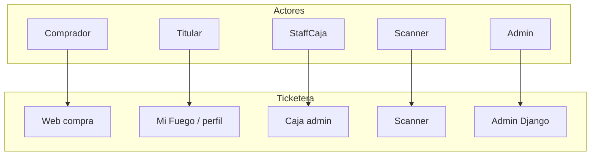

# Documentación de producto y dominio

Esta carpeta complementa el [README principal](../README.md) del repositorio: allí está el **setup de desarrollo**, migraciones de base de datos, deploy y arquitectura técnica. Aquí se describe **cómo opera la ticketera** (actores, reglas de negocio, modelos y integraciones) para equipo de producto, operaciones y desarrollo.

## Índice

| Documento | Contenido |
|-----------|-----------|
| [Casos de uso](casos-de-uso.md) | Actores, flujos y URLs principales |
| [Eventos, roles y operación](eventos-roles-y-operacion.md) | Alta de evento, admins/scanner/caja, dos cajas, bonos dirigidos, grupos e ingreso anticipado |
| [Funcionalidades](funcionalidades.md) | Módulos Django y responsabilidades |
| [Configuración](configuracion.md) | Variables de entorno y settings |
| [Evento FA](evento-fa.md) | Modelo `Event`, grupos, términos y sede |
| [Bonos y cupones](bonos-y-cupones.md) | `TicketType`, `Coupon`, disponibilidad |
| [Transferencias de bonos](transferencias-de-bonos.md) | Usuario con perfil vs email pendiente vs link legado (`TicketTransfer`) |
| [Órdenes y pagos](ordenes-y-pagos.md) | Estados de orden, emisión de bonos, MercadoPago |
| [Reglas de negocio](reglas-de-negocio.md) | Restricciones y decisiones codificadas |
| [Integraciones](integraciones.md) | MercadoPago, Google, email, S3, Twilio |
| [Deploy y ramas](deploy-y-ramas.md) | Resumen operativo; enlace al README |
| [Glosario](glosario.md) | Vocabulario común |

## Diagrama de actores

Para roles, alta de eventos y caja, ver [eventos-roles-y-operacion](eventos-roles-y-operacion.md).

Para volver al desarrollo local, tests o CI/CD, usá el [README en la raíz del repo](../README.md).
